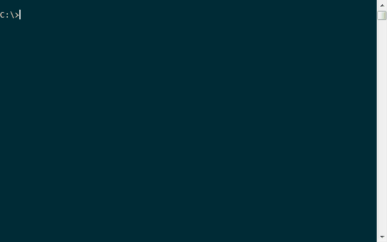
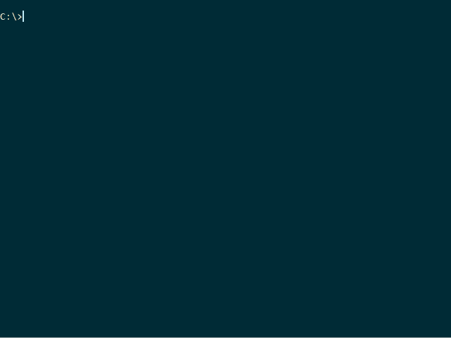

[](https://travis-ci.org/MatthiasKauer/tim)
**Note: I'm in the process of adapting the cram tests to tim; this is difficult on Windows and happens only when I feel like booting up my Linux machine. I am using tim daily already however**

## tim in a nutshell
tim provides a command-line interface for recording time logs. Its design goals are the following:

* Simplicity. If a time tracker tool makes me think for more than 3-5 seconds, I lose my line
of thought and forget what I was doing. For this reason, I loved [ti](https://github.com/sharat87/ti) and simplified it further.
* Stand on the shoulder of giants. All aggregation is handled by [hledger](http://hledger.org). Convenience commands are added to the tim interface.
* Text file storage. Its *your* data. Location of your data can be adjusted in ```~/.tim.ini```. Consider ```tim ini``` if you want to move away from the default location.

Oh and by the way, the source is a fairly small python script, so if you know
python, you may want to skim over it to get a better feel of how it works.

The following animation shows the basic commands begin, switch, end.
Data is recorded in json format and can be manually adjusted using any text editor. On my system, vim is assigned for this task.


When calling ```tim hl```, commands are piped to [hledger](http://hledger.org) for aggregation. Hledger must be installed separately which is simple thanks to their single exe binary for Windows and the integration in most Linux package management systems (```sudo apt-get install hledger``` should work, for instance).
The next animation demonstrates how ```tim hl balance``` and the associated ```tim hl1``` (for the data of today) aggregate data. Depth of the data tree can be adjusted, and filtering works as well. Hledger is very powerful in that regard.
Try
```
tim hl balance --help
```
to see all options that hledger offers.


Since hledger is primarily an accounting tool, not all its commands are useful for tim. ```hledger balance``` is arguably the most useful. Others I use are
```
tim hl activity
tim hl print
```

## Installation
### tim
tim is on PyPI: https://pypi.python.org/pypi/tim-ledger_diary

Install it via:
```
pip install tim-ledger_diary
```

### hledger
[hledger](http://hledger.org) must be installed separately. Download the hledger binary for Windows and add it to PATH.

On Ubuntu, install via 
```
sudo apt-get install hledger
```
At this point, I don't think you need a specific version. Choose the most recent one on your system and report back if things don't work in that way.
There's a good chance you can also make this tool work with other command-line tools that share the same timelog format like [ledger-cli](http://www.ledger-cli.org/), but I haven't tested that.


## differences to ti
tim tries to simplify [ti](https://github.com/sharat87/ti) by relying on [hledger](http://hledger.org/) (which must be on your path) for number crunching.

Biggest changes:

* hledger omits tasks that are too short. 4min, rounded up to 0.1 h seems to be the cut-off.
* interrupts are gone because the stack is complex; you can call switch if you want to start work on something else. If you enter finish, nothing is automatically started. 
* hl command hands over your data to hledger to perform aggregations. [hledger manual](http://hledger.org/manual.html#timelog)
* note is gone. 
* tag is gone (for now)

## Caveats
### File size considerations
My tim-sheet grows roughly 2KB / day. That's about 700kB / year. Probably less if I don't track weekends.
Writing line by line the way I am doing it now is starting to get slow already however (at 6KB). hledger itself is significantly faster. As soon as this difference bothers me enough I will switch to storing in hledger format directly s.t. the speed will no longer be an issue.

## For developers
### Python environment installation
#### Windows
We develop using Anaconda with package manager [conda](http://conda.io/).
You can install all packages in our environment (inspect environment.yml beforehand; expect 2-3 min of linking/downloading, probably more if your conda base installation is still very basic or has vastly different packages than mine) using:
```
conda env create
```
if it already exists you may have to remove it first.

    * Read <name> on top of environment.yml
    * Confirm via ```conda env list```
    * Remove ```conda env remove --name <name>```

If you feel like updating the environment, run ```conda env export -f environment.yml``` and commit it to the repository.

*Note*: If you have used the previous bash version of `ti`, which was horribly
tied up to only work on linux, you might notice the lack of *plugins* in this
python version. I am not really missing them, so I might not add them. If anyone
has any interesting use cases for it, I'm willing to consider.

## Who?

Created and fed by Shrikant Sharat
([@sharat87](https://twitter.com/#!sharat87)). To get in touch, ping me on
twitter or <a href=mailto:shrikantsharat.k@gmail.com>email</a>.

## License
[MIT License](http://mitl.sharats.me).
